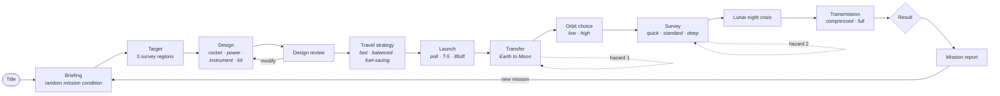
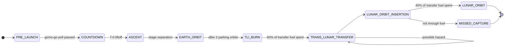
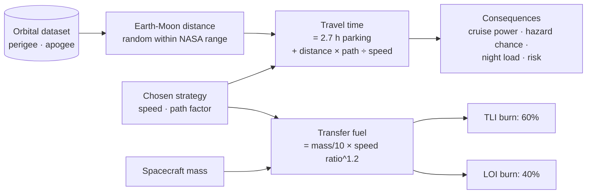
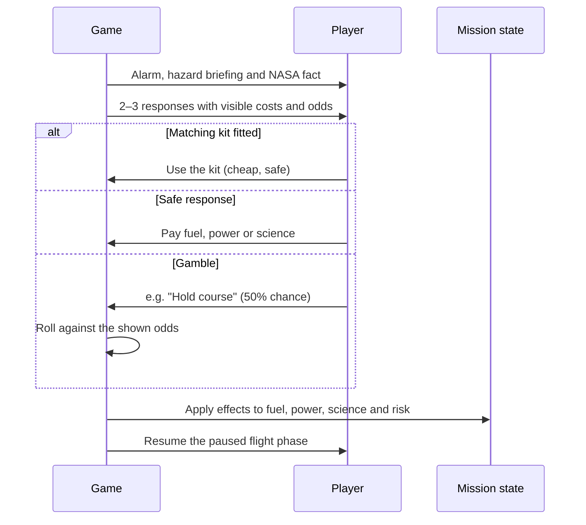
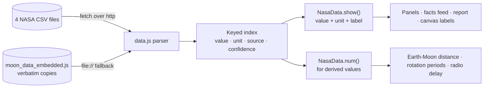
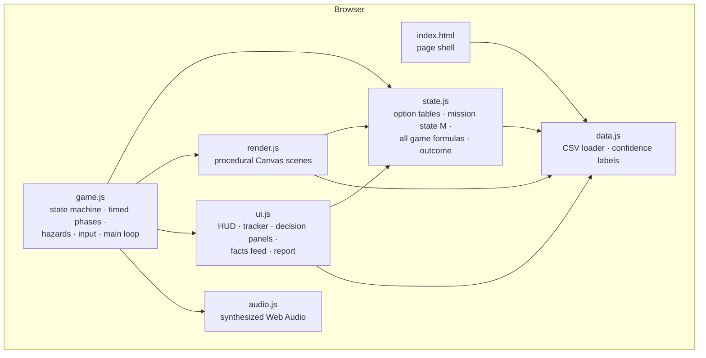
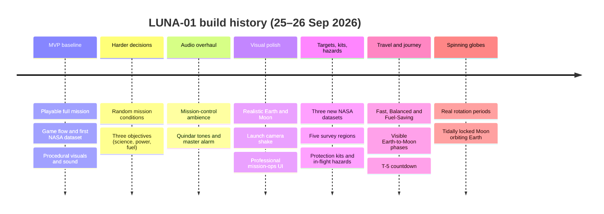

<div align="center">

# 🌙 LUNA-01: Mission Control

**Design, launch and fly a robotic lunar science mission, using real NASA data.**

*NASA Space Apps Challenge 2026 · Challenge: Space Mission Design Game*


> **"There is no perfect mission design. Every advantage has a cost."**

</div>

---

## Contents

- [The idea](#-the-idea)
- [Play it in 30 seconds](#-play-it-in-30-seconds)
- [How a mission plays](#-how-a-mission-plays)
- [Game mechanics](#-game-mechanics)
- [NASA data and scientific honesty](#-nasa-data-and-scientific-honesty)
- [Architecture](#-architecture)
- [Balance and testing](#-balance-and-testing)
- [Development timeline](#-development-timeline)
- [Repository layout](#-repository-layout)
- [Assumptions and limitations](#-assumptions-and-limitations)

---

## 🎯 The idea

Real space missions are shaped by trade-offs. A bigger rocket costs half the budget. A faster trip burns more fuel. A deeper scan drains power before the lunar night arrives. **LUNA-01** turns those trade-offs into a short, replayable game for students and the public.

You are the **Mission Director** of one robotic lunar science mission. You never fly the spacecraft; you make the calls. In **about 6–8 minutes** you:

1. Choose **where on the Moon** to survey.
2. **Design** the spacecraft: rocket, power system, instrument and protection kit.
3. Choose **how fast to fly** to the Moon.
4. **Launch**, orbit Earth, fire the trans-lunar injection burn, coast, and brake into lunar orbit.
5. Survive **in-flight hazards**, survey your target, and handle a **lunar-night power crisis**.
6. **Transmit** the science back to Earth and read your mission report.

Every lunar fact on screen comes from **NASA datasets** and carries a label saying how reliable it is. Gameplay numbers are always labelled **GAME MODEL**.

| What players learn | How the game teaches it |
|---|---|
| Mission design is about trade-offs | Every option shows its benefit ▲ and cost ▼ before you commit |
| Mass, fuel, power and budget are linked | Live budget, mass, power, fuel and communication readouts during design |
| Getting to the Moon takes days and a lot of fuel | Travel strategies with calculated time and fuel, calibrated to Apollo 8, Apollo 11 and Artemis I |
| The Moon is a harsh place | Hazards grounded in NASA data: meteoroids (no atmosphere), radiation, solar storms, charged dust, the long lunar night |
| Different regions answer different questions | Five real survey targets, each favouring a different instrument |
| Why we only see one face of the Moon | Rotating Earth and Moon at their real rotation periods; the tidally locked Moon orbits Earth in the briefing |

---

## ▶ Play it in 30 seconds

No installation, no build step, no internet connection needed.

**Option A: double-click.** Open `LUNA-01 Mission Control/index.html` in Chrome, Edge or Firefox. On `file://` the game uses embedded copies of the CSV files.

**Option B: local server (recommended for demos).** The game then reads the real CSV files directly.

```bash
cd "LUNA-01 Mission Control"
python -m http.server 8123
```

Then open <http://localhost:8123>.

| Control | Action |
|---|---|
| Mouse | Choose options and confirm |
| `1`–`5` or `A`–`D` | Pick decision options |
| `M` | Toggle sound |

---

## 🚀 How a mission plays



The mission tracker at the top of the screen follows the same path: **TARGET → DESIGN → LAUNCH → TRANSFER → ORBIT → SURVEY → DOWNLINK → RESULT**.

### The Earth-to-Moon journey

The transfer is shown as a sequence of real flight phases. Fuel is actually deducted at each burn, and a hazard can strike during the coast.



A mission-elapsed-time clock, the remaining time to arrival and the live range to the Moon are shown throughout. The Earth and Moon rotate at their real rates on that same clock.

---

## ⚙ Game mechanics

All numbers below are the **simplified game model** (in `src/state.js`). They are chosen for balance and teaching, and are never presented as NASA measurements.

### 1. Mission condition (random each run)

| Condition | Effect |
|---|---|
| ☀ **Solar Maximum** | Every risk increase ×1.5 · Radiation Sensor +10 science per scan · solar-storm and computer-upset threat HIGH |
| ☾ **Long Lunar Night** | Lunar-night drain ×1.5 · using reserve power costs more |
| $ **Budget Cut** | Budget cap $80M instead of $100M |
| ❄ **Ice Hunt** | Science goal raised from 70 to 80 · Spectrometer +8 per scan at the South Pole |

### 2. Survey target

| Target | Best instrument | Trade-off |
|---|---|---|
| South Polar Region (Cabeus) | Spectrometer +10, science ×1.1 | Darkest and coldest: night drain ×1.15, Camera −8, −3% fuel |
| Mare Tranquillitatis Pit | Camera +12, downlink −20% power | Apollo 11 already sampled it: science ×0.9 |
| Marius Hills Pit | Radiation Sensor +12, downlink −15% power | Spectrometer +0, −2% fuel |
| Descartes Highlands | Spectrometer +12, science ×1.05 | Deep dusty regolith: HIGH dust threat in low orbit |
| Far Side Highlands | Science ×1.25 | No line of sight to Earth (tidal lock): downlink +40% power, +8 risk, −5% fuel |

### 3. Spacecraft design

Budget cap $100M (or $80M), maximum mass 800 kg, and at least 60% power margin at launch.

| Slot | Options (cost · mass · key stat) |
|---|---|
| **Rocket** | Light ($15M · 520 kg capacity · 60% fuel) · Medium ($30M · 600 kg · 85%) · Heavy ($50M · 800 kg · 100%) |
| **Power** | Basic Solar ($6M · 40 kg · 70%) · High-Capacity Solar ($14M · 85 kg · 100%) · Solar + Battery ($20M · 120 kg · 85%, absorbs night drain) |
| **Instrument** | Camera ($8M · 25 kg · base science 48) · Radiation Sensor ($14M · 45 kg · 52) · Spectrometer ($22M · 70 kg · 56) |
| **Protection kit** | None · Whipple Shield ($5M, meteoroids) · Rad-Hard Avionics ($6M, solar storms and computer upsets) · Dust Covers ($3M, dust) · Spare Tank ($5M, +10% fuel, leaks) |

Communication strength is derived from the design: the rocket fairing sets the dish size and the power system sets the transmitter power. A **threat forecast** shows the odds of each hazard before launch.

### 4. Travel strategy: the physics-inspired model



| Strategy | Time at mean distance | Fuel for a 555 kg craft | Consequences |
|---|---|---|---|
| **FAST** | ≈ 2 d 14 h | ≈ 71% (HIGH) | +4 risk (hot arrival) · transit hazard ≈ 36% · night load ×0.89 |
| **BALANCED** | ≈ 3 d 4 h (Apollo 11 reference) | ≈ 56% (MEDIUM) | −3% cruise power · transit hazard ≈ 70% |
| **FUEL-SAVING** | ≈ 5 d (Artemis I reference) | ≈ 43% (LOW) | −9% cruise power · transit hazard 100% · night load ×1.35 · more radiation hazards |

A strategy is disabled if it would leave less than 10% fuel after lunar orbit insertion. If a hazard drains the tank mid-coast, the insertion burn can fail and LUNA-01 flies past the Moon.

### 5. Hazards and decisions

One hazard may strike during the transfer (the chance grows with coast time) and one always strikes during the survey. Which hazard appears is weighted by target, condition, rocket, orbit and travel time.

| Hazard | NASA data behind it | Kit that counters it |
|---|---|---|
| ☄ Meteoroid swarm | No lunar atmosphere, so meteoroids arrive at full speed | Whipple Shield |
| ⛽ Propellant leak | Lunar escape velocity: you must still brake on arrival | Spare Tank |
| ⚠ Flight-computer upset | Apollo surface radiation dose | Rad-Hard Avionics |
| ☀ Solar particle event | August 1972 solar storm dose (estimate) | Rad-Hard Avionics |
| ◌ Charged dust | Dust covering that halves solar-cell output | Dust Covers |



### 6. Winning

| Outcome | Condition |
|---|---|
| ✅ **Success** | Science ≥ goal **and** power ≥ 15% **and** fuel ≥ 10% |
| ❌ **Failure** | Power reaches 0%, **or** risk ≥ 75 (safe mode), **or** science < 40, **or** lunar capture missed |
| ⚠ **Partial success** | Anything in between |

Risk ≥ 40 causes a data-loss anomaly during transmission, which costs 20% of the science.

---

## 📊 NASA data and scientific honesty

The game uses four datasets with **91 values** in total. They are read at runtime and never edited.

| Dataset | Rows | Used for |
|---|---|---|
| `moon_environment_dataset.csv` | 21 | Gravity, temperatures, water ice (LCROSS), radiation, atmosphere, lunar day and night |
| `moon_regions_non_polar_dataset.csv` | 19 | Apollo landing coordinates (plotted on the target map), Tranquillitatis and Marius Hills pits, maria and highland chemistry, crust thickness |
| `moon_dust_dataset.csv` | 21 | Descartes regolith, the dust hazard, dust facts |
| `earth_moon_orbital_dataset.csv` | 30 | Perigee and apogee, Moon orbital speed, radio delay, escape velocity, tidal lock, Earth and Moon rotation periods |

Sources include the NASA NSSDCA Moon and Earth fact sheets, LCROSS, the Apollo mission records and NASA dust studies. Each row keeps its source and URL, and the in-game **Sources** panel lists them.

**Every value on screen carries a confidence label:**

| Label | Meaning |
|---|---|
| `NASA DATA` | Value as given by the NASA source |
| `NASA · APPROX.` | The source marks it approximate (e.g. LCROSS "~6% water") |
| `NASA · QUALITATIVE` | The source gives only a description (e.g. young-maria regolith "a few feet") |
| `ESTIMATE · UNCERTAIN` | The dataset marks it an estimate |
| `DERIVED FROM NASA` | Calculated from NASA values (e.g. radio delay, escape-velocity ratio) |
| `LAB SIMULANT` | Measured on artificial Moon dust, not real dust |
| `GAME MODEL` | A simplified gameplay number, **not** a NASA measurement |



---

## 🏗 Architecture

**Pure web platform: no frameworks, engines, libraries or backend, and no image or audio files.** Every pixel is drawn with Canvas 2D and every sound is synthesized with the Web Audio API. Classic `<script>` tags (not ES modules) let the game run straight from `file://`.



| Module | Lines | Responsibility |
|---|---|---|
| `src/data.js` | 154 | Parses the CSV files, builds a keyed index, formats values and attaches confidence labels |
| `src/state.js` | 769 | Every option table, the mission state `M`, all gameplay formulas, the hazard model and the outcome |
| `src/game.js` | 361 | State machine (`Game.go`, `ENTER[state]`, `Game.setPhase`), timed transitions in `update(dt)`, input, boot |
| `src/render.js` | 1,498 | One procedural scene per state: spacecraft, rockets, globes, trajectories, hazard effects, particles |
| `src/ui.js` | 754 | HTML overlay: HUD bars, mission tracker, decision and hazard panels, NASA facts feed, final report |
| `src/audio.js` | 290 | Compressor chain, mission-control ambience, Quindar tones, master alarm, launch explosion, burns, hazards |

### Procedural graphics

- **Rotating Earth and Moon.** Both are generated at startup as longitude/latitude surface maps. The major maria and named craters (Tycho, Copernicus and others) sit in their approximate real places, so the Apollo sites from the dataset land on the right terrain. Each frame the maps are wrapped onto spheres through a precomputed per-pixel lookup, so the globes spin while sunlight stays fixed.
- **Real rotation periods** from the orbital dataset: Earth 23.9345 h, Moon 655.72 h. During the journey they follow the mission clock. Elsewhere they use a labelled time-lapse (1 s = 4 h).
- **Tidal lock shown, not just told.** In the briefing the Moon circles Earth while always turning the same face towards it.
- **Spacecraft** drawn from your actual design: the dish size depends on the rocket, and the fitted protection kit is visible.
- **Effects:** launch plume and camera shake, meteoroid swarms, venting propellant, computer glitches, solar-storm glare, clinging dust, data packets flying to Earth.
- **Performance:** about 1–5 ms per frame on a fixed 1280×720 stage that scales to any window.

### Synthesized audio

The sound is all synthesized, with no audio files:
- a mission-control ambience and NASA-style Quindar tones;
- the countdown, the master alarm and a launch explosion;
- engine burns, scans and the data transmission;
- a sound for each hazard: proximity pings, hissing leaks, glitches, static and impacts;
- stings for success, partial success and failure.

---

## 🧪 Balance and testing

The game model is deterministic apart from explicit random draws, so **every path through a mission can be computed**. A headless Node simulator loads `src/state.js` and plays every decision with expectimax over hazard weights and gamble odds:

```
resetMission(condition) → pick region → commitDesign → setTravel → departEarth
→ transit hazard (prob. = hazard chance) → arrive → chooseOrbit → survey hazard
→ runScan → applyEventDrain → chooseEvent → transmit → evaluate
```

Results across all **20 target × condition combinations**:

| Metric | Result |
|---|---|
| Best play (best design + best decisions) | Wins **79–100%** in every combination |
| Deliberate trap: Tranquillitatis + Ice Hunt | ≈ 45% even with best play |
| Random valid design, then best play | Only **≈ 13–30%** |
| Designs winning ≥ 80% per combination | 3–12, so there are several good answers |
| Best strategy per design | Mostly Balanced, but Fast and Fuel-Saving win for some designs |

In short: **your design choices matter, no single plan wins everywhere, and protection kits are decisive where the threat is HIGH.**

Every feature was also tested in the browser: complete playthroughs, fuel and time calculations, panel overflow, frame time and console errors.

---

## 🗓 Development timeline



---

## 📁 Repository layout

```
LUNA-01 Mission Control/
├── index.html                 page shell and script tags (runs from file://)
├── style.css                  mission-operations UI, fixed 1280x720 stage
├── src/
│   ├── data.js                CSV loader, confidence labels, formatting
│   ├── state.js               game model: options, formulas, hazards, outcome
│   ├── game.js                state machine, timed phases, input, main loop
│   ├── render.js              procedural Canvas scenes and rotating globes
│   ├── ui.js                  HUD, tracker, panels, facts feed, report
│   └── audio.js               synthesized Web Audio
├── data/
│   ├── moon_environment_dataset.csv
│   ├── moon_regions_non_polar_dataset.csv
│   ├── moon_dust_dataset.csv
│   ├── earth_moon_orbital_dataset.csv
│   └── moon_data_embedded.js  generated copies for file:// (node tools/embed-csv.js)
├── tools/embed-csv.js         regenerates the embedded data after a CSV change
├── docs/LUNA-01_GDD.pdf       game design document
└── README.md                  detailed technical notes
```

About **4,300 lines** of hand-written HTML, CSS and JavaScript, with **zero dependencies**.

---

## 📌 Assumptions and limitations

- The game **does not simulate real orbital mechanics**. Travel time and fuel use a transparent, calibrated model, and the trajectories are drawn stylised and not to scale.
- Budget, power, fuel, science, mass, communication, risk and hazard odds are a **simplified game model** and are labelled that way.
- Polar and far-side coordinates are not in the datasets. Those markers are placed approximately and labelled as such. The Apollo coordinates are shown exactly as in the regions CSV.
- The Moon views are tilted 15° so the south polar region is visible. The maria and crater placement is a visual approximation, never shown as data.
- The dust hazard is a simplified scenario *inspired by* NASA dust data, and the game says so.
- The time-lapse speed of the rotating globes is labelled on screen. The rotation periods themselves are NASA values.

---

<div align="center">

**LUNA-01: Mission Control** · NASA Space Apps Challenge 2026

*Built with nothing but the web platform, real NASA data, and honest labels.*

</div>
